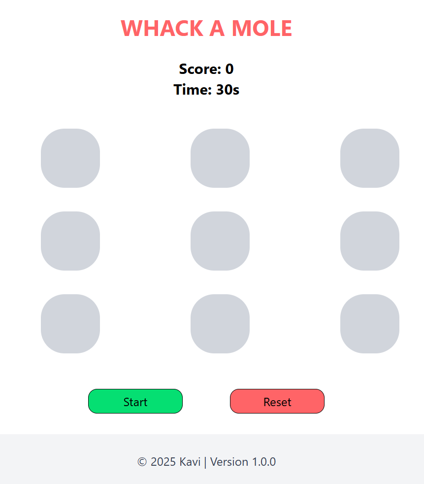

## Whack-a-Mole Game

A fun Whack-a-Mole game built with React, TypeScript, TailwindCSS, and tested with Jest + React Testing Library.

Players click the moles that randomly appear on a 3x3 board to earn points before the 30-second timer runs out.

## When Page Loads 

Score: 0
Timer: 30s
Appear on a 3x3 grid with empty holes
Start button active, Reset button disabled

## After Game Starts 

Timer counts down from 30s.
Score updates when moles are clicked.
Random moles images appear in random holes.
Reset button becomes available.-

## How to Play

Start Game: Click Start to reset score and timer and spawn random moles.
Whack Moles: Click active moles to earn points. Moles disappear after being clicked or after 1 second.
Reset Game: Click Reset to stop the timer, clear the board, and reset the score to 0.
Game Over: Timer reaches 0 -> moles stop appearing -> final score remains visible.

## Features

30-second countdown timer.
Random mole appearances in 3x3 grid.
Real-time score updates.
Start and Reset controls.
Styled with TailwindCSS.
Tested with Jest + React Testing Library.

## Component	Purpose

## Home Component
Manages score, timer, and game state
Passes props to GameBoard and ControlPanel
Starts and resets the game

## GameBoard Component
->Renders 3x3 grid of holes  
->Randomly spawns 3 moles every second  
->Handles mole clicks to increment score

## Mole Component
Clickable mole button  
Increments score when clicked  

## ControlPanel Component
Provides Start and Reset buttons  
Triggers game state changes via parent callbacks  

## ScoreBoard Component
Displays current score  

## Timer Component
Shows remaining time  

## Header Component
Displays game title  

## Footer Component
Displays developer information 

## Unit Tests

-->ScoreBoard → shows the correct score, updates when props change.
-->Timer → shows time left, updates correctly when props change.
-->GameBoard → always has 9 holes, can show up to 3 moles, and renders mole images with correct attributes.
-->ControlPanel → renders Start/Reset buttons and calls the right callbacks.
-->Mole → renders a mole button and triggers onClick when clicked.

## Integration Tests

--> Home Page → ensures all components render together correctly.
-->  Clicking Start → begins the game, moles appear, timer decreases.
-->  Clicking a Mole → increments the score.
--> Clicking Reset → score resets, timer resets, moles disappear.
--> When timer reaches 0 → game ends, no more moles appear.
--> GameBoard integration → only increments score when mole is clicked, does nothing when clicking an empty hole, clears moles when game stops.